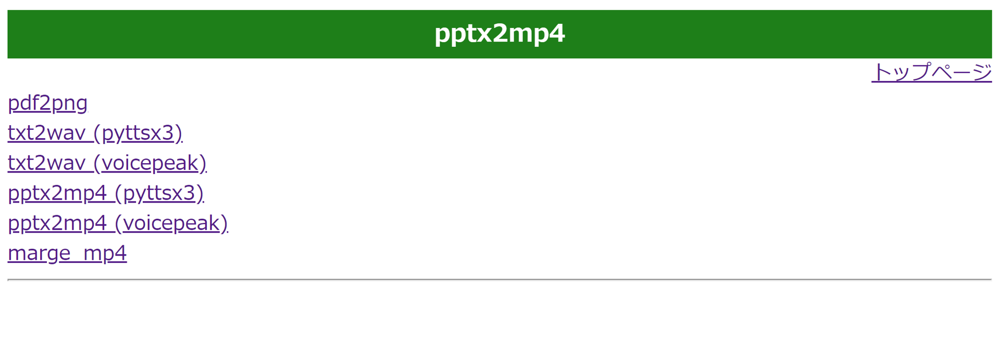

# Python による PowerPoint 動画作成 Webアプリ pptx2mp4

パワーポイントを動画に変換する自作ソフトを作成した. Pythonを用いてパワーポイントファイルから動画を作成するwebアプリケーションである. Windowsにのみ対応する.
pdf2png: pdfスライド1枚目をyoutube用サムネイルにする.
txt2wav (pyttsx3): テキストファイルを音声ファイルにする.
txt2wav (voicepeak): テキストファイルを音声ファイルにする (voicepeak使用).
pptx2mp4 (pyttsx3): パワーポイントファイルから動画を作成する.
pptx2mp4 (voicepeak): パワーポイントファイルから動画を作成する (voicepeak使用).
marge_mp4: 複数のmp4ファイルをファイル名辞書順に結合する.
tex2mp4 (pyttsx3): TeXファイルから動画を作成する.
tex2mp4  (voicepeak): TeXファイルから動画を作成する. (voicepeak使用).


## 実行環境
```
Windows11
Python 3.8.10
```

## requirements
```
Flask==3.0.3
flask_sqlalchemy==3.1.1
moviepy==1.0.3
opencv_python==4.10.0.84
pdf2image==1.17.0
Pillow==9.5.0
Pillow==10.4.0
pydub==0.25.1
pyttsx3==2.90
Werkzeug==3.0.3
```
## Git Clone

```
$ git clone https://github.com/butsurinokeisanya/pptx2mp4.git

```

## 移動
```
$ cd pptx2mp4
```
## パッケージインストール

```
$ pip install -r requirements.txt
```


## アプリケーション起動

```
$ py app.py
```

## ブラウザで下記リンクにアクセス
トップページが表示されれば成功である.
```
http://127.0.0.1:5000/
```

## 次回以降はクリックで起動できる.
boot.batはアプリケーション起動とブラウザでローカルホストhttp://127.0.0.1:5000/ にアクセスするバッチファイルである. 次回からはboot.batをクリックで実行するとブラウザでwebアプリケーションが立ち上がる.

## 注意事項と要請
われわれは本ソフトフェア一式を使用した結果生じた障害と損失には一切責任を負わない. また不具合, バグ, 誤り (マニュアル, 文書, 実行例) が見つかったら直ちに報告していただければ幸甚である. 

pptx2mp4を用いて得た動画を共有サイト, 講義, 学会発表などで発表する際には本サイト
```
https://github.com/butsurinokeisanya/pptx2mp4.git
```
を概要欄や参考文書などで引用しなければならない.